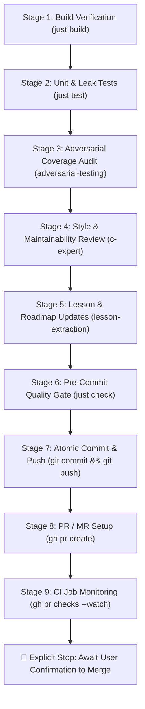

# Milestone Finalization & Quality Gatekeeping Skill (`finalize`)

This skill defines the rigorous, automated multi-stage pipeline for finalizing, verifying, and shipping engineering milestones in `trash-gather`.

The goal of this skill is to ensure that no code is ever committed, pushed, or opened for review without passing every compiler check, achieving 100.00% line coverage, satisfying memory safety invariants, leaving behind durable educational documentation, and verifying continuous integration pipelines.

______________________________________________________________________

## 🛑 Strict Operational Invariants

1. **Explicit Stop on Failure**: If **ANY** stage in this pipeline fails, reports errors, or reveals code quality defects, **HALT IMMEDIATELY**. Do not proceed to subsequent stages. Clearly report the failure, root cause, and diagnostic logs to the developer.
1. **Never Merge Without Explicit Agreement**: The AI agent must **NEVER** merge, squash-merge, or fast-forward a Pull Request / Merge Request into `main` without explicit, unambiguous confirmation from the human developer. Opening the PR and confirming all CI checks pass is the terminal boundary of this skill.
1. **Never Touch `src/`**: In accordance with project directives (`AGENTS.md`), the agent audits, tests, and documents runtime code, but all edits to files within `src/` are written exclusively by the human developer.

______________________________________________________________________

## 🔄 The 9-Stage Finalization Pipeline

When finalizing a milestone or upon user invocation (`/finalize`), execute these 9 stages sequentially:



______________________________________________________________________

### Stage 1: Clean Build Verification (`just build`)

- Execute `just build`.
- **Target Invariant**: Compiles cleanly with zero compiler warnings and zero errors under ISO C17 (`-std=c17`, `-Wall`, `-Wextra`, `-Wswitch`) with AddressSanitizer and UndefinedBehaviorSanitizer active.
- **Halt Action**: If compilation fails or emits compiler diagnostics, halt immediately and present the compiler diagnostics.

______________________________________________________________________

### Stage 2: Unit & Adversarial Test Suite (`just test`)

- Execute `just test`.
- **Target Invariant**: 100% pass rate across the full test suite.
- **Memory Invariant**: Every test must verify zero memory leaks via `assert(boot_all_freed())`.
- **Halt Action**: If any test fails or triggers an ASan/UBSan report or memory leak, halt immediately and inspect `.failures/` log files.

______________________________________________________________________

### Stage 3: Adversarial Coverage Audit & Invariant Verification (`just coverage` / `adversarial-testing` Skill)

- **Follow the Skill**: All adversarial heuristics, fault injection patterns, and stress testing protocols are defined in the **`adversarial-testing`** skill: \[.agents/skills/adversarial-testing/SKILL.md\](file:///Users/bwrob/dev/trash-gather/.agents/skills/adversarial-testing/SKILL.md).
- Execute `just coverage`.
- **Target Invariant**: **100.00% line coverage** across all files in `src/` (`src/vm.c`, `src/object.c`, `src/new.c`, `src/stack.c`).
- **Adversarial Safety Audit Checklist** (strictly audited per the `adversarial-testing` skill):
  - [ ] **NULL Safety**: API functions safely reject `NULL` arguments without segmentation faults.
  - [ ] **Container Lifecycle Parity**: Container child objects released via pure `refcount_dec()` rather than masked solely by `vm_free()`.
  - [ ] **Cycle Reclaimability**: Self-referencing cycles and mutual cycle meshes are cleanly swept by `vm_collect_garbage()`.
  - [ ] **Allocation Failure Rollback**: Multi-step allocations unwound cleanly without leaks via `boot_set_fail_alloc_after()`.
  - [ ] **Boundary Conditions**: Empty containers (`0` length/capacity), sparse containers (NULL slots), and large sequences verified.
- **Halt Action**: If any line in `src/` is uncovered (< 100.00%) or any adversarial invariant from the `adversarial-testing` skill is unverified, halt immediately and write missing test probes in `tests/`.

______________________________________________________________________

### Stage 4: Code Review for Style, Idiomatic C & Maintainability

- Audit runtime changes using the 5-phase review protocol from the `c-expert` skill:
  1. **API Namespacing & Modularity**: Public functions follow clear domain prefixes (`object_*`, `list_*`, `vm_*`).
  1. **Memory Safety & Ownership**: Pointer ownership contracts (borrowed vs. owned) are unambiguous; zero double-free or use-after-free hazards.
  1. **Exhaustiveness & Defensive Guards**: `switch` statements over enums are exhaustive (`-Wswitch`); fall-through undefined behavior is prevented.
  1. **Maintainability & DRY**: Redundant code, magic numbers, or boilerplate eliminated; sizing arithmetic uses `sizeof(ptr[0])`.
  1. **`const` Correctness**: Inspection-only parameters are qualified with `const` to provide compiler-checked read-only guarantees.
- **Halt Action**: If structural defects or style anti-patterns are discovered, provide actionable Socratic guidance and pause for developer refinement before proceeding to commit.

______________________________________________________________________

### Stage 5: Educational Lesson Extraction & Roadmap Synchronization

- Follow the `lesson-extraction` and `roadmap-milestone` skills:
  1. **Create Lesson Writeup**: Author `lessons/NN_<topic_slug>.md` covering System Engineering, Pitfalls & Diagnostics, Architectural Solutions, Optimization, and Tooling Takeaways.
  1. **Update Lesson Index**: Add the new lesson to `lessons/README.md`.
  1. **Update Roadmap Milestone**: Set status to `Completed` in `roadmap/<hash>_<slug>.md`.
  1. **Update Roadmap Index & DAG**: Update status to `✅ Completed` and Mermaid styling to `:::completed` in `roadmap/README.md`.
  1. **Validate Roadmap**: Run `just lint-roadmap` to confirm 100% DAG synchronization and schema compliance.
- **Halt Action**: If the roadmap linter or link checks fail, halt immediately.

______________________________________________________________________

### Stage 6: Pre-Commit Quality Gate & Formatting (`just check`)

- Run `just format` to format C, C++, Python, Markdown, and TOML files.
- Run `just check` to execute all pre-commit hooks:
  - `clang-format`, `mdformat`, `taplo`
  - `ruff` (lint + format) and `pyrefly`
  - Clang `-Wdocumentation` Doxygen docstrings check (`just lint-docs`)
  - `just lint-roadmap`
- **Halt Action**: If any pre-commit hook reports a failure or diff, halt immediately.

______________________________________________________________________

### Stage 7: Atomic Conventional Commit & Push

- Inspect git status: `git status`.
- Stage changes and craft a descriptive, conventional commit message:
  ```bash
  git add ...
  git commit -m "feat(<scope>): <concise description>

  - Architectural improvements and memory invariants
  - 100.00% line coverage and adversarial verification
  - Extracted Lesson NN (<lesson title>)
  - Completes Roadmap Milestone <hash_id> (<slug>)
  "
  ```
- Push to remote tracking branch:
  ```bash
  git push -u origin <branch-name>
  ```
- **Halt Action**: If the commit or push fails, halt immediately and report the git error.

______________________________________________________________________

### Stage 8: Pull Request / Merge Request Setup

- Verify whether an open PR exists:
  ```bash
  gh pr view 2>/dev/null || gh pr list --head $(git branch --show-current)
  ```
- If no PR exists, open one using GitHub CLI (`gh pr create`):
  - **Title**: Conventional commit style (e.g. `feat: polymorphic sequence length protocol and const invariants`).
  - **Body**: Structured according to project standards:
    - `## Summary`: Milestone reference and technical scope.
    - `### Architectural Changes`: Memory layout, data structures, and runtime mechanics.
    - `### Verification & Quality Gates`: Pass rate, coverage percentage, sanitizer status, leak tracking.
    - `### Educational Lesson`: Link to `lessons/NN_*.md`.
- **Halt Action**: If PR creation fails, halt immediately.

______________________________________________________________________

### Stage 9: CI Pipeline Verification & Monitoring

- Monitor triggered GitHub Actions workflow runs:
  ```bash
  gh pr checks --watch
  ```
- Verify that all CI jobs pass:
  1. `pre-commit` (formatting, linting, docstrings, unit tests)
  1. `clang-tidy` (deep static analysis on `src/*.c`)
  1. `build` (sandbox binary compilation)
  1. `benchmark build` (Google Benchmark compilation)
  1. `coverage` (100.00% gcov line coverage verification)
- **Halt Action**: If any CI check fails, fetch the failed run logs (`gh run view --log-failed`), report the failure, and halt immediately.

______________________________________________________________________

## 🛑 The Terminal Boundary: Await Explicit Merge Agreement

Once Stage 9 succeeds and all CI jobs are green:

1. Print a clear, celebratory summary table detailing the PR link, test counts, coverage, and extracted lesson.
1. **Explicitly STOP**: Do **NOT** run `gh pr merge` or merge the PR.
1. Prompt the user for explicit instructions on whether they wish to merge, inspect, or proceed to the next milestone.
