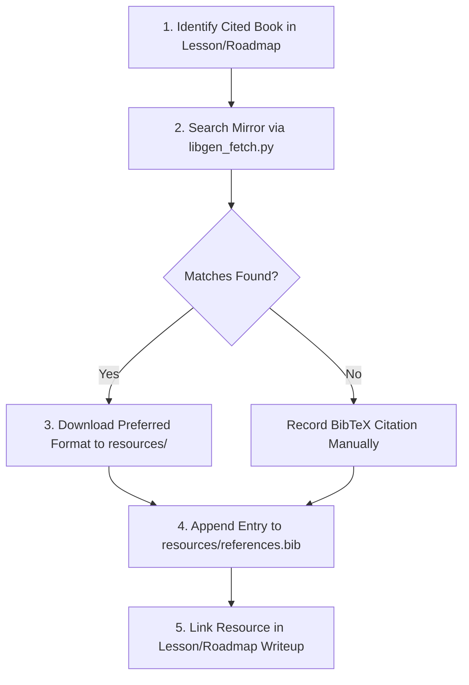

# Libgen Resource Skill (`libgen-resource`)

This skill defines the process and tooling for searching, downloading, and indexing educational engineering literature from Library Genesis into the project's tracked `resources/` directory.

______

## 🎯 Core Objectives & Operational Boundaries

1. **Automatic Acquisition**: Whenever an educational book or canonical textbook (e.g. *The Garbage Collection Handbook*, *Crafting Interpreters*, *Computer Systems: A Programmer's Perspective*) is mentioned or cited in `lessons/` or `roadmap/`, query Library Genesis to retrieve it if available.
2. **Tracked Repository Storage**: Downloaded artifacts and bibliography files are placed in `resources/` (which is **never gitignored**).
3. **Persistent Bibliography**: Every retrieved or cited resource must have an authoritative BibTeX entry maintained in [`resources/references.bib`](file:///Users/bwrob/dev/trash-gather/resources/references.bib).
4. **Resilient Failure Handling**: Network interruptions or mirror rate-limits must never halt workflow progress. If an automated download stream times out, record the BibTeX citation and primary mirror URL cleanly into `resources/references.bib`.

______

## 🔄 Standard Workflow



### Step 1: Search for Literature

To inspect candidates without downloading:

```bash
uv run python .agents/skills/libgen-resource/scripts/libgen_fetch.py search "<Title or Author>" --limit 5
```

### Step 2: Download & Register into Bibliography

To fetch the book, save it to `resources/`, and register its BibTeX entry:

```bash
uv run python .agents/skills/libgen-resource/scripts/libgen_fetch.py download "<Title or Keywords>" --preferred-format pdf
```

- Target file is saved strictly as `resources/<author_surname>_<year>_<short_title_slug>.<ext>` (e.g. `seacord_2020_effective_c.pdf`).
- Formatted `@book{...}` entry is appended to [`resources/references.bib`](file:///Users/bwrob/dev/trash-gather/resources/references.bib) with matching key `<author_surname><year><short_title>` (e.g. `seacord2020effective`).

______

## 📝 External Templates & Reference Manuals

- **BibTeX Schema Template**: [resources/bibtex_template.bib](./resources/bibtex_template.bib)
- **Mirror Architecture & Troubleshooting Manual**: [references/manual.md](./references/manual.md)
- **CLI Tool Source**: [scripts/libgen_fetch.py](./scripts/libgen_fetch.py)

______

## 📋 Quality Invariants

- [ ] `resources/` and all files inside it must remain strictly tracked by git (never gitignored).
- [ ] Every downloaded or cited resource has a corresponding entry in `resources/references.bib`.
- [ ] Script adheres strictly to `scripts/AGENTS.md` (built with `typer`, no `argparse`).
- [ ] All code conforms to `ruff`, `pyrefly`, and formatting standards (`just check`).
