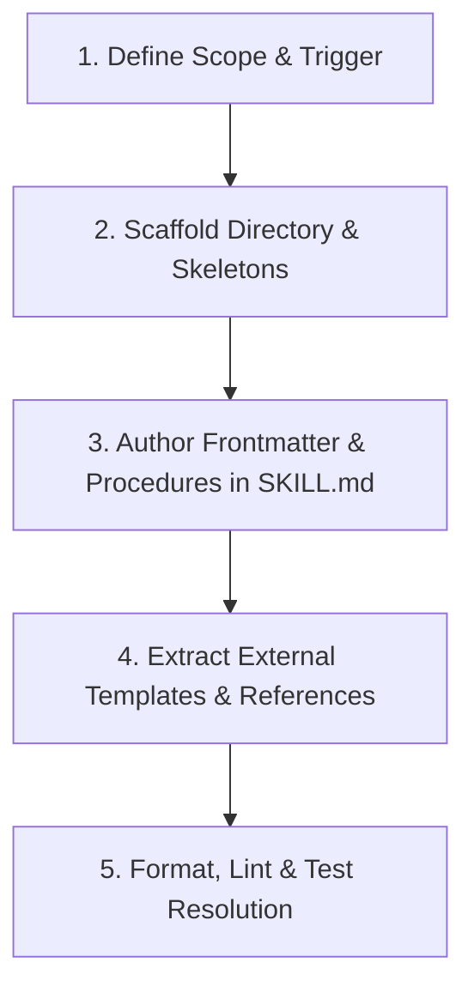

# Skill Creator & Architect Skill (`skill-creator`)

This skill defines the architectural standards, directory layouts, and step-by-step workflow for authoring, scaffolding, and refactoring **Antigravity Skills** in `.agents/skills/`.

______

## 🧭 Core Architectural Principles

1. **Progressive Disclosure**:
   - `SKILL.md` is loaded into the agent's context when activated. Keep it concise, structural, and focused on navigation, workflows, and invariants.
   - Deep manuals, background theory, and API catalogs belong in `references/`.
   - Reusable file templates, boilerplate skeletons, and schemas belong in `resources/`.
1. **Externalize Templates to Dedicated Files (Never Inline)**:
   - **Strict Mandate**: If a skill defines, scaffolds, or guides the creation of structured files (such as test suites, benchmark harnesses, pull requests, educational lessons, or configuration schemas), you **MUST externalize the template into a separate file** in `resources/` (e.g. `resources/<name>_template.<ext>`).
   - **No Inlining**: Multi-line code skeletons, whole-file templates, or extensive markdown outlines must **never** be inlined directly inside `SKILL.md`.
   - **Refactoring Rule**: When auditing or updating an existing skill that contains an inlined template, immediately extract it out into a dedicated file in `resources/` and replace the inline snippet with a direct markdown link.
1. **Actionable Procedures & Quality Gates**:
   - Frame instructions imperatively.
   - Include explicit halting criteria, verification commands (`just check`, `just test`), and quality rubrics.
1. **Executable Tooling**:
   - Put helper automation and CLI utilities in `scripts/` so agents and developers can execute them directly.

______

## 📁 Standard Skill Directory Layout

Every skill must be structured as a subdirectory under `.agents/skills/`:

```text
.agents/skills/<skill_name>/
├── SKILL.md                 # Required: Main instruction file with YAML frontmatter
├── resources/               # Optional: Reusable file templates, schemas, and assets
│   └── <artifact>_template.<ext>
├── references/              # Optional: Deep architectural manuals, runbooks, theory
│   └── <topic>.md
└── scripts/                 # Optional: Executable Python or shell automation tools
    └── <utility>.py
```

______

## 🔄 5-Step Skill Creation Workflow



### 1. Define Scope & Trigger

- Choose a unique, kebab-case name (e.g. `cache-profiling`, `leak-detection`).
- Define the **exact activation criteria** for the `description` field:
  - What does the skill do?
  - When should the agent load and execute it? (Use third-person phrasing).

### 2. Scaffold the Skill Directory

Run the automated scaffolding utility:

```bash
uv run python .agents/skills/skill-creator/scripts/scaffold_skill.py <skill-name> --description "<Trigger description>"
```

This scaffolds `.agents/skills/<skill-name>/` containing `SKILL.md`, `resources/`, `references/`, and `scripts/`.

### 3. Author Frontmatter & Procedures in `SKILL.md`

- **Frontmatter Requirements**:

  ```yaml
  ---
  name: <skill-name>
  description: >-
    Actionable third-person description of what this skill does and when to activate it.
  ---
  ```

- **Core Procedures**: Document sequential stages, operational invariants, and exact shell commands.
- **Cross-Links**: Use GitHub markdown links to link directly to template files (e.g. `[resources/template.md](./resources/template.md)`).

### 4. Externalize Templates to New Files & Author References

- **Externalize Templates**: If the skill defines or guides the generation of code, test files, benchmarks, PR descriptions, or documents, **create a separate template file** in `resources/` (e.g. `resources/<artifact>_template.<ext>`). Never inline the skeleton in `SKILL.md`.
- **Author Reference Manuals**: If the skill includes deep technical theory, architecture catalogs, or debugging guides, place them in dedicated markdown files in `references/`.
- **Link from SKILL.md**: Add clear, clickable links from `SKILL.md` to the external template files so the agent can inspect them on demand.

### 5. Format & Validate

- Run markdown formatting to ensure style compliance:

  ```bash
  just format-md
  ```

- Run formatting and linting verification across the project:

  ```bash
  just format-check
  ```

______

## 📝 Reusable Templates

- **Starter Skill Template**: [resources/skill_template.md](./resources/skill_template.md)
- **Scaffolding Utility**: [scripts/scaffold_skill.py](./scripts/scaffold_skill.py)
