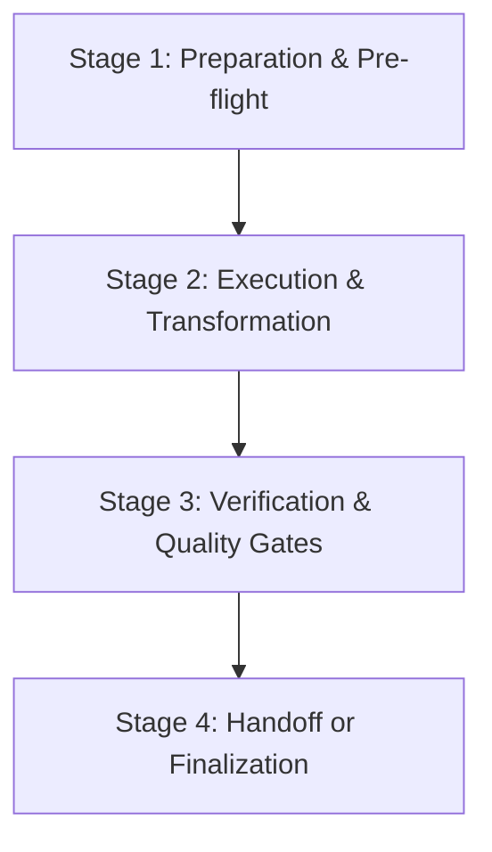

# ${SKILL_TITLE} Skill (`${SKILL_NAME}`)

${SKILL_SUMMARY}

______

## 🎯 Core Objectives & Responsibilities

1. **Primary Goal**: Clear description of what the agent accomplishes when executing this skill.
1. **Operational Boundaries**: What is in-scope vs. out-of-scope.
1. **Invariants & Non-Negotiables**: Critical constraints that must never be violated.

______

## 🔄 Standard Workflow & Execution Stages

Explain the sequential workflow or decision tree for the skill:

### Stage 1: Preparation & Pre-flight

- Steps to inspect state, check inputs, or verify prerequisites.

### Stage 2: Execution & Transformation

- Step-by-step procedure for executing the core task.
- Detail edge-case handling and defensive strategies.

### Stage 3: Verification & Quality Gates

- How to verify that the output or changes meet project standards.

### Stage 4: Handoff or Completion

- Finalization actions, reporting, or user handoff.

______

## 📝 External Templates & Reference Manuals

> [!IMPORTANT]
> **Mandatory Template Externalization**: Never inline multi-line code skeletons, document templates, or whole-file outlines directly into `SKILL.md`. Always place them in dedicated files inside `resources/` (e.g. `resources/<artifact>_template.<ext>`) and link to them here.

- **Templates (`resources/`)**: [resources/template.md](./resources/template.md)
- **Deep References (`references/`)**: [references/manual.md](./references/manual.md)

______

## 🛠️ Tooling & Command Reference

| Command          | Action / Purpose          |
| :--------------- | :------------------------ |
| `just <command>` | Description of the action |
