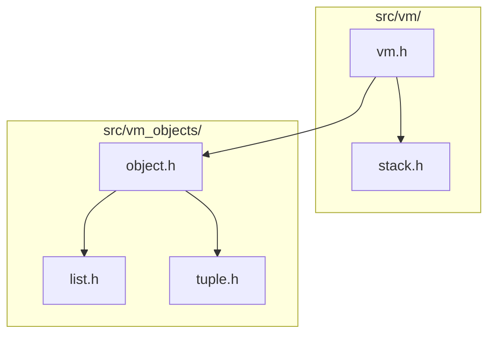

# trash-gather

Explorations in automatic memory management and virtual machine runtime implementation in C.

<!-- HEADER_DAG_START -->

<!-- HEADER_DAG_END -->

## 💡 Overview

`trash-gather` is an educational project exploring how programming language virtual machines allocate, track, and reclaim memory. Written in C from scratch, it implements a **hybrid garbage collection runtime**:

- **Immediate Reference Counting**: Fast, deterministic deallocation for acyclic objects.
- **Mark-and-Sweep Cycle Collector**: Periodic detection and reclamation of cyclic pointer graphs.
- **Zero-Leak Guarantee**: Enforced across every test with AddressSanitizer (ASan), UndefinedBehaviorSanitizer (UBSan), and `bootlib` heap tracking.
- **Modern Tooling from Day One**: Automated linting (`clang-tidy`, `ruff`, `pyrefly`), strict formatting (`clang-format`, `rumdl`), and pre-commit checks.

## 🚀 Quickstart

```bash
# 1. Install macOS dependencies (compiler, just, linters)
brew bundle

# 2. Run the unit test suite with ASan and leak tracking
just test

# 3. Build and execute the interactive sandbox
just run
```

For the complete developer command reference, test filters, benchmarking, and AI pair-programming directives, see **[`AGENTS.md`](AGENTS.md)**.

## 🎯 Architecture & Roadmap

The runtime feature progression and systems milestones are organized as a pedagogical **Directed Acyclic Graph (DAG)** spanning object semantics, container memory layouts, and garbage collection algorithms.

👉 **[Explore the Roadmap & Dependency Graph (`roadmap/README.md`)](roadmap/README.md)**

## 🎓 Origin

This project originated as a continuation and expansion of the **Memory Management & Garbage Collector** curriculum on [Boot.dev](https://www.boot.dev)—an exceptional hands-on platform for learning backend engineering, systems programming, and computer science fundamentals.
