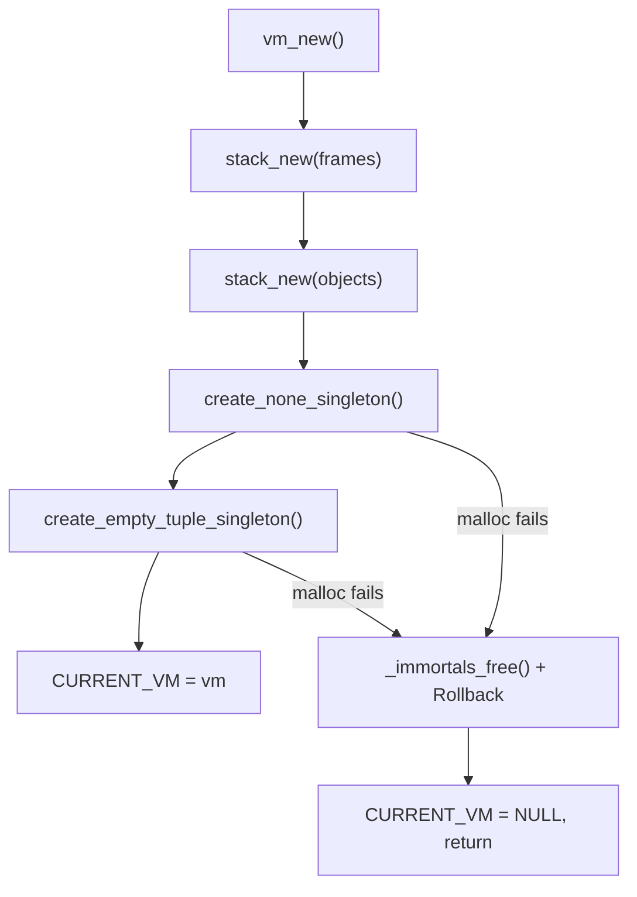

# Lesson 05: Immortal Singletons & PEP 683 Architecture

**Branch:** `none-immortal-singleton` (Merged in PR #5)\
**Focus:** Implementing zero-allocation immortal singletons (`None` and `()`) via PEP 683 refcount immunity, C17 linkage semantics, and cyclic GC bypass.

______________________________________________________________________

## 1. System Engineering & Core Concepts

### 1.1 The Null Object Pattern & Python's `None`

In high-level language runtimes like Python, `None` is not the absence of a pointer (C `NULL`). Instead, it is a first-class object (`Py_None` of type `PyNone_Type`) inhabiting a dedicated memory address.

- **Identity over Equality**: In Python, testing `x is None` compares machine pointers (`x == vm->immortals.none`), which executes in a single CPU instruction without dispatching to comparison methods.
- **Polymorphic Container Safety**: Treating `None` as a valid `object_t` allows lists and tuples to store uninitialized or sentinel values without defensive `NULL` checks across every container accessor (`list_get`, `list_set`, etc.).

### 1.2 PEP 683: Immortal Objects Using a Fixed Refcount

In standard reference-counted runtimes, every shared reference to a singleton increments its reference count, and every deallocation decrements it. In multi-threaded runtimes or applications with heavy container churn, constantly mutating the refcount of singletons like `None`, `True`, `False`, or empty containers (`()`) introduces severe systems liabilities:

1. **Cache-Line Bouncing**: Modifying reference counts dirties CPU cache lines for objects that are conceptually immutable and read-only.
1. **Copy-on-Write (CoW) Degradation**: In multi-process architectures (e.g., `fork()` in Unix), touching a singleton refcount marks its memory page dirty, forcing the OS to duplicate physical pages and exploding memory footprint.
1. **Overflow Hazards**: Frequent increments without bounds could theoretically wrap integer counters.

Python 3.12 resolved this via **PEP 683 (Immortal Objects, Using a Fixed Refcount)**. The core mechanism is elegant:

```c
#define OBJECT_IMMORTAL_REFCOUNT SIZE_MAX

bool object_is_immortal(const object_t *obj) {
    if (obj == NULL) return false;
    return obj->refcount == OBJECT_IMMORTAL_REFCOUNT;
}
```

Whenever `refcount_inc()` or `refcount_dec()` is invoked:

```c
void refcount_inc(object_t *obj) {
    if (obj == NULL || object_is_immortal(obj)) return;
    obj->refcount++;
}

void refcount_dec(object_t *obj) {
    if (obj == NULL || object_is_immortal(obj)) return;
    obj->refcount--;
    if (obj->refcount == 0) object_free(obj);
}
```

Because the refcount is pinned to `SIZE_MAX`, it is never modified. Immortals achieve complete immunity from destruction without requiring special-case branching at the call site.

______________________________________________________________________

## 2. Pitfalls, Failure Modes & Diagnosis

### 2.1 The C vs. C++ Linkage Trap on File-Scope `const`

When defining the immortal refcount sentinel, an intuitive approach is:

```c
// In object.h
const size_t OBJECT_IMMORTAL_REFCOUNT = SIZE_MAX;
```

While this compiles cleanly in C++, it triggers fatal link-time failures under ISO C17:

```
duplicate symbol '_OBJECT_IMMORTAL_REFCOUNT' in:
    bin/new.o
    bin/object.o
    bin/vm.o
```

- **The Standards Divergence**: In C++ (C++17 §10.1.1), `const` objects at file scope have **internal linkage** by default (equivalent to `static const`). In ISO C (C17 §6.2.2), `const` at file scope has **external linkage** by default! Every `.c` file including `object.h` emitted a strong definition of `_OBJECT_IMMORTAL_REFCOUNT`.
- **The Fix**: In C systems headers, compile-time scalar constants must be declared via pre-processor macros (`#define OBJECT_IMMORTAL_REFCOUNT SIZE_MAX`) or `enum` definitions to prevent multiple external symbol generation.

### 2.2 Teardown Ordering in `vm_free()` (The Premature NULL Trap)

In an early iteration, `vm_free()` set the global VM pointer to `NULL` at the top of the function:

```c
void vm_free() {
    CURRENT_VM = NULL; // <-- Premature!
    ...
    for (size_t i = 0; i < vm->frames->count; i++) {
        frame_free(vm->frames->data[i]); // calls object_free -> vm_untrack_object
    }
}
```

- **The Crash**: `frame_free()` frees objects whose refcount hits zero. `object_free()` calls `vm_untrack_object(obj)`, which checks `vm = vm_get_current()`. Because `CURRENT_VM` was already `NULL`, `vm_untrack_object()` aborted early, leaving stale entries in the tracked objects stack or triggering asserts.
- **The Invariant**: Global environment pointers must remain valid throughout the entire destruction sequence. `CURRENT_VM = NULL;` must always be the **very last line** after `free(vm)`.

### 2.3 The Mark Bit Persistence on Untracked Singletons

During garbage collection, `sweep()` only iterates through `vm->objects`:

```c
for (size_t i = 0; i < vm->objects->count; i++) {
    object_t *obj = vm->objects->data[i];
    if (obj->is_marked) {
        obj->is_marked = false;
        continue;
    }
    ...
}
```

Because `None` and `()` are housed in `vm->immortals` and excluded from `vm->objects`, if the GC marking or tracing phase sets `obj->is_marked = true` on singletons, `sweep()` never clears the flag! The singletons remain permanently marked across all future GC cycles.

- **Architectural Solution**: Immortal objects must **bypass cyclic GC marking entirely**:
  ```c
  if (obj_ == NULL || object_is_immortal(obj_)) continue;
  ```
  Immortals never enter the `gray_objects` stack, never have their `is_marked` bit written to, and never consume GC traversal cycles.

______________________________________________________________________

## 3. Architectural Solutions & Mental Models

### 3.1 Eager Bootstrapping vs. Lazy Allocation

Rather than allocating `None` on its first access (which would make `new_none()` fallible and require runtime allocation failure checks), the VM adopts **eager startup bootstrapping**:



1. `vm_new()` allocates `none` and `empty_tuple` during VM initialization.
1. If any singleton allocation fails under memory pressure, `vm_new()` executes a clean multi-stage rollback (`_immortals_free`, `stack_free`, `free(vm)`), leaving zero memory leaks and `CURRENT_VM == NULL`.
1. Once initialized, `new_none()` and `new_tuple_0()` are **100% infallible, zero-allocation accessors**.

### 3.2 Scoped Memory Verification with Checkpoints

Previously, leak verification relied solely on `boot_all_freed()`, requiring tests to destroy the entire VM to prove an individual container didn't leak. We upgraded `bootlib` with **scoped checkpoints**:

```c
boot_checkpoint_t cp = boot_checkpoint();

// Run local operations
object_t *lst = new_list(2);
list_set(lst, 0, new_none());
refcount_dec(lst);

// Assert 100% of memory allocated since checkpoint is freed,
// while the VM and immortals remain active!
assert_true(boot_checkpoint_all_freed(cp));
```

______________________________________________________________________

## 4. Tooling Insights & Workflow Takeaways

1. **Empirical Zero-Allocation Verification**:
   Using `boot_total_alloc_count()`, unit tests now mathematically prove that accessing `new_none()` or `new_tuple_0()` does not allocate:
   ```c
   size_t allocs_before = boot_total_alloc_count();
   object_t *n = new_none();
   assert_size(boot_total_alloc_count(), ==, allocs_before);
   ```
1. **Verified Fault Injection**:
   Using `boot_fail_alloc_triggered()`, every allocation failure test verifies that `bootlib` actually intercepted and rejected an allocation, preventing silent false-positive tests.
1. **Persistent OOM Simulation**:
   `boot_set_fail_alloc_repeat(0, -1)` enables simulating total heap exhaustion, proving that constructors unwind safely when *every* allocation attempt fails.
