# Architecture & Pedagogical Roadmap DAG (`roadmap/`)

This directory represents the **single authoritative source of truth** for the architecture, engineering milestones, and curriculum of `trash-gather`.

Rather than scattered, parallel tracks, the learning journey is modeled as **one single unified pedagogical Directed Acyclic Graph (DAG)**. Foundational milestones establish memory safety and runtime stability, after which engineering challenges advance strictly by **prerequisite dependencies and difficulty level (easiest tasks first)**.

Every milestone is identified by a **stable 7-character hexadecimal hash ID** (`<hash>_<slug>.md`) and calibrated with a **Difficulty Level from 1 (entry) to 5 (expert)**.

______________________________________________________________________

## 🗺️ Unified Pedagogical Dependency Graph

```mermaid
%%{
  init: {
    'flowchart': {
      'layout': 'elk',
      'elk': {
        'cycleBreaking.strategy': 'DEPTH_FIRST',
        'transitiveReduction': true
      }
    }
  }
}%%
flowchart TD
  classDef completed fill:#2ea44f,stroke:#22863a,color:#ffffff,stroke-width:2px;
  classDef inProgress fill:#d9a826,stroke:#b08800,color:#ffffff,stroke-width:2px;
  classDef planned fill:#f6f8fa,stroke:#d1d5da,color:#24292e,stroke-width:1px;

  subgraph Tier0 ["Tier 0: Bootstrapped Foundation & Runtime Core (Completed)"]
    direction TB
    m_tooling["d9c6780: Modern Tooling & Safety (Diff: 1)"]:::completed
    m_hybrid["393f420: Hybrid GC Runtime (Diff: 3)"]:::completed
    m_tuple["f9c475f: Variable-Length Tuple (Diff: 2)"]:::completed
    m_seqlen["b81f9a7: Sequence Length Protocol (Diff: 1)"]:::completed
    m_none["fc1cc81: None Immortal Singleton (Diff: 1)"]:::completed
  end

  subgraph Tier1 ["Tier 1: Foundational Ergonomics & Singletons (Difficulty 1)"]
    direction TB
    subgraph T1_Ergo ["Core Ergonomics"]
      direction TB
      m_negidx["b0c1d8b: Sequence Negative<br/>Indexing (Diff: 1)"]:::planned
      m_variadic_pack["5b538ed: Variadic Object<br/>Constructors (Diff: 1)"]:::planned
    end
    subgraph T1_Data ["Singletons & Lists"]
      direction TB
      m_bool["6c3a989: Boolean Singletons<br/>& Truthiness (Diff: 1)"]:::planned
      m_smallint["70b20d3: Small Integer<br/>Caching (Diff: 1)"]:::planned
      m_dynamic_resizable_list["d7b5feb: Dynamic Resizable<br/>List Mutations (Diff: 1)"]:::planned
    end
  end

  subgraph Tier2 ["Tier 2: Intermediate Arithmetic, Telemetry & Slabs (Difficulty 2)"]
    direction TB
    subgraph T2_Math ["Arithmetic & Matrices"]
      direction TB
      m_mul["687b4cb: Polymorphic<br/>Multiplication (Diff: 2)"]:::planned
      m_complex["212a3d8: Complex Numbers<br/>& Arithmetic (Diff: 2)"]:::planned
      m_matrix["e67df2f: Contiguous 2D<br/>Float Matrix (Diff: 2)"]:::planned
    end
    subgraph T2_Mem ["Memory & Inspection"]
      direction TB
      m_slab["e10d642: Single-Arena Object<br/>Slab Allocator (Diff: 2)"]:::planned
      m_bytes["52fb556: Raw Byte Buffer<br/>Object (bytes_t) (Diff: 2)"]:::planned
      m_string_builder["4911b8b: Dynamic String<br/>Builder (Diff: 2)"]:::planned
      m_telem["330a2b1: GC Telemetry &<br/>Metrics (Diff: 2)"]:::planned
      m_viz["81a16cb: ASCII Heap<br/>Visualizer (Diff: 2)"]:::planned
    end
    subgraph T2_Proto ["Protocols & Dispatch"]
      direction TB
      m_bitflags["c87f151: Object Header<br/>Bitflags (Diff: 2)"]:::planned
      m_vtables["54d0d12: Type Descriptor<br/>Vtables (Diff: 2)"]:::planned
      m_hash["8782a4d: Object Hashing<br/>Protocol (Diff: 2)"]:::planned
      m_sort["3f1132d: Rich Comparisons<br/>& Sorting (Diff: 2)"]:::planned
    end
  end

  subgraph Tier3 ["Tier 3: Advanced Views, Iterators, Pacing & Pools (Difficulty 3)"]
    direction TB
    subgraph T3_Views ["Views & Containers"]
      direction TB
      m_strided_matrix["eb930e7: Strided Matrix<br/>Views & Transpose (Diff: 3)"]:::planned
      m_slice["c44db02: Non-Owning<br/>Sequence Slices (Diff: 3)"]:::planned
      m_dict_fixed["5895af9: Fixed-Capacity<br/>Hash Table (Diff: 3)"]:::planned
      m_cycle_iter["586680e: Cycle Iterator<br/>Object (Diff: 3)"]:::planned
    end
    subgraph T3_Alloc ["Allocators & Generations"]
      direction TB
      m_slab_chaining["f682854: Multi-Arena Slab<br/>Chaining (Diff: 3)"]:::planned
      m_pool["7ebcf1a: Multi-Size-Class<br/>Pool Allocator (Diff: 3)"]:::planned
      m_pacing["eaa403e: Automatic GC<br/>Pacing (Diff: 3)"]:::planned
      m_gen_track["01be152: Dual-Generation<br/>Tracking (Diff: 3)"]:::planned
    end
    subgraph T3_IO ["Serialization & Strings"]
      direction TB
      m_repr["bf0a981: Cycle-Safe String<br/>Repr (Diff: 3)"]:::planned
      m_serialization["402c62c: Binary Heap Graph<br/>Serialization (Diff: 3)"]:::planned
    end
  end

  subgraph Tier4 ["Tier 4: CPython Hierarchy, Collections & PyMalloc (Difficulty 4)"]
    direction TB
    subgraph T4_Core ["Model & Allocators"]
      direction TB
      m_offset0["222f6ce: Offset-0 Base<br/>Hierarchy (Diff: 4)"]:::planned
      m_pymalloc["a929415: Page-Aligned<br/>PyMalloc (Diff: 4)"]:::planned
    end
    subgraph T4_Collections ["Collections & Handles"]
      direction TB
      m_dict_dynamic["e883213: Dict Tombstones<br/>& Rehashing (Diff: 4)"]:::planned
      m_dll["11c2c6a: Doubly Linked<br/>Lists (Diff: 4)"]:::planned
      m_weakref["a7ca40b: Weak References<br/>& Handles (Diff: 4)"]:::planned
    end
  end

  subgraph Tier5 ["Tier 5: Expert Closures, Generational GC & Tooling (Difficulty 4-5)"]
    direction TB
    subgraph T5_Runtime ["Closures & GC Barriers"]
      direction TB
      m_closure["a0c00e1: Closures & Lexical<br/>Environments (Diff: 5)"]:::planned
      m_gen_barrier["034b527: Write Barriers &<br/>Minor GC (Diff: 4)"]:::planned
    end
    subgraph T5_Tools ["Interactive REPL"]
      direction TB
      m_repl["0fcfad7: Interactive Memory<br/>REPL (Diff: 4)"]:::planned
    end
  end

  m_bitflags --> m_hash
  m_bitflags --> m_slab
  m_bool --> m_bitflags
  m_bool --> m_complex
  m_bool --> m_cycle_iter
  m_bool --> m_sort
  m_bytes --> m_slice
  m_closure --> m_repl
  m_complex --> m_matrix
  m_cycle_iter --> m_repr
  m_dict_dynamic --> m_closure
  m_dict_fixed --> m_dict_dynamic
  m_dynamic_resizable_list --> m_bytes
  m_dynamic_resizable_list --> m_sort
  m_dynamic_resizable_list --> m_string_builder
  m_gen_barrier --> m_repl
  m_gen_track --> m_gen_barrier
  m_hash --> m_dict_fixed
  m_hybrid --> m_tuple
  m_matrix --> m_repr
  m_matrix --> m_strided_matrix
  m_mul --> m_complex
  m_mul --> m_vtables
  m_negidx --> m_mul
  m_negidx --> m_slice
  m_none --> m_bool
  m_none --> m_smallint
  m_none --> m_telem
  m_offset0 --> m_dll
  m_offset0 --> m_weakref
  m_pacing --> m_gen_track
  m_pool --> m_pymalloc
  m_pymalloc --> m_repl
  m_repr --> m_offset0
  m_repr --> m_repl
  m_repr --> m_serialization
  m_seqlen --> m_bool
  m_seqlen --> m_dynamic_resizable_list
  m_seqlen --> m_negidx
  m_slab --> m_slab_chaining
  m_slab_chaining --> m_pool
  m_sort --> m_dict_fixed
  m_string_builder --> m_repr
  m_telem --> m_pacing
  m_telem --> m_viz
  m_tooling --> m_hybrid
  m_tuple --> m_none
  m_tuple --> m_seqlen
  m_tuple --> m_variadic_pack
  m_viz --> m_repl

  Tier0 ~~~ Tier1
  Tier1 ~~~ Tier2
  Tier2 ~~~ Tier3
  Tier3 ~~~ Tier4
  Tier4 ~~~ Tier5
```

______________________________________________________________________

## 📚 Milestone Progression Index

### Tier 0: Bootstrapped Foundation & Runtime Core (Completed)

1. **[Learning-Friendly Modern Tooling & Safety Infrastructure](d9c6780_learning_friendly_setup.md)**

   - **ID:** `d9c6780`
   - **Status:** ✅ Completed
   - **Difficulty:** 1 / 5
   - **Prerequisites:** None
   - **Focus:** Professional C tooling from day one (`just`, ASan/UBSan, `bootlib`, `clang-tidy`, `clang-format`, `uv`, `ruff`, `pyrefly`, `pre-commit`, and µnit).

1. **[Hybrid Reference Counting & Cycle Collection Runtime](393f420_hybrid_gc_runtime.md)**

   - **ID:** `393f420`
   - **Status:** ✅ Completed
   - **Difficulty:** 3 / 5
   - **Prerequisites:** [`d9c6780`](d9c6780_learning_friendly_setup.md)
   - **Focus:** Immediate reference counting combined with mark-and-sweep cycle collection, resolving the single-pass deallocation trap, and POSIX de-sneking.

1. **[Heap-Allocated Variable-Length Tuple](f9c475f_heap_allocated_variable_length_tuple.md)**

   - **ID:** `f9c475f`
   - **Status:** ✅ Completed
   - **Difficulty:** 2 / 5
   - **Prerequisites:** [`393f420`](393f420_hybrid_gc_runtime.md)
   - **Focus:** Python-style arbitrary-length immutable tuples via heap-allocated `tuple_t` with a C99 flexible array member, contiguous allocation math, and GC lifecycle integration.

1. **[Polymorphic Sequence Length Protocol](b81f9a7_polymorphic_sequence_length.md)**

   - **ID:** `b81f9a7`
   - **Status:** ✅ Completed
   - **Difficulty:** 1 / 5
   - **Prerequisites:** [`f9c475f`](f9c475f_heap_allocated_variable_length_tuple.md)
   - **Focus:** Implement a polymorphic sequence length protocol (`object_len`) unifying length queries across Strings, Lists, and Tuples with $O(1)$ complexity.

1. **[The `None` Immortal Singleton Object](fc1cc81_none_immortal_singleton.md)**

   - **ID:** `fc1cc81`
   - **Status:** ✅ Completed
   - **Difficulty:** 1 / 5
   - **Prerequisites:** [`f9c475f`](f9c475f_heap_allocated_variable_length_tuple.md)
   - **Focus:** Implement the `None` singleton object, protect it against GC sweep deallocation (immortality), and use it for uninitialized slots and default returns.

______________________________________________________________________

### Tier 1: Foundational Ergonomics & Singletons (Difficulty 1)

1. **[Python-Style Sequence Negative Indexing](b0c1d8b_python_sequence_negative_indexing.md)**

   - **ID:** `b0c1d8b`
   - **Status:** 📋 Planned
   - **Difficulty:** 1 / 5
   - **Prerequisites:** [`b81f9a7`](b81f9a7_polymorphic_sequence_length.md)
   - **Focus:** Support signed integer offsets (`int64_t`) across list and tuple accessors, enabling Python-style negative indexing (`seq[-1]`) with underflow validation.

1. **[Boolean Immortal Singletons & Truthiness](6c3a989_bool_singletons_and_truthiness.md)**

   - **ID:** `6c3a989`
   - **Status:** 📋 Planned
   - **Difficulty:** 1 / 5
   - **Prerequisites:** [`fc1cc81`](fc1cc81_none_immortal_singleton.md), [`b81f9a7`](b81f9a7_polymorphic_sequence_length.md)
   - **Focus:** Implement immortal boolean singleton objects (`True` and `False`), protect them from GC sweep deallocation, introduce polymorphic truthiness evaluation (`object_is_truthy`, `object_to_bool`), and implement short-circuiting iteration predicates (`object_all`, `object_any`).

1. **[Small Integer Caching](70b20d3_small_integer_caching.md)**

   - **ID:** `70b20d3`
   - **Status:** 📋 Planned
   - **Difficulty:** 1 / 5
   - **Prerequisites:** [`fc1cc81`](fc1cc81_none_immortal_singleton.md)
   - **Focus:** Pre-allocate an immortal static cache of small integer objects (`[-128, 127]`), eliminating heap allocation churn for common numbers and introducing pointer identity semantics.

1. **[Dynamic Resizable List Mutations](d7b5feb_dynamic_resizable_list.md)**

   - **ID:** `d7b5feb`
   - **Status:** 📋 Planned
   - **Difficulty:** 1 / 5
   - **Prerequisites:** [`b81f9a7`](b81f9a7_polymorphic_sequence_length.md)
   - **Focus:** Transform `list_t` into a dynamically resizable sequence supporting `list_append()`, `list_insert()`, and `list_pop()` with amortized $O(1)$ geometric growth and `memmove` overlapping memory shifts.

1. **[Variadic Object Packing Constructors](5b538ed_variadic_tuple_and_list_pack.md)**

   - **ID:** `5b538ed`
   - **Status:** 📋 Planned
   - **Difficulty:** 1 / 5
   - **Prerequisites:** [`f9c475f`](f9c475f_heap_allocated_variable_length_tuple.md)
   - **Focus:** Introduce variadic constructors (`new_tuple_pack`, `new_list_pack`) using `<stdarg.h>`, replacing hardcoded fixed-arity constructors and mastering variadic unpacking and cleanup safety.

______________________________________________________________________

### Tier 2: Intermediate Arithmetic, Telemetry & Slabs (Difficulty 2)

1. **[Polymorphic Multiplication & Sequence Repetition](687b4cb_polymorphic_multiplication.md)**

   - **ID:** `687b4cb`
   - **Status:** 📋 Planned
   - **Difficulty:** 2 / 5
   - **Prerequisites:** [`b81f9a7`](b81f9a7_polymorphic_sequence_length.md), [`b0c1d8b`](b0c1d8b_python_sequence_negative_indexing.md)
   - **Focus:** Implement polymorphic binary multiplication (`multiply`) supporting numeric arithmetic (integer and float) and Python-style sequence repetition (string, list, tuple) with commutative operand ordering.

1. **[Complex Numbers & Arithmetic](212a3d8_complex_numbers.md)**

   - **ID:** `212a3d8`
   - **Status:** 📋 Planned
   - **Difficulty:** 2 / 5
   - **Prerequisites:** [`687b4cb`](687b4cb_polymorphic_multiplication.md), [`6c3a989`](6c3a989_bool_singletons_and_truthiness.md)
   - **Focus:** Introduce Python-style complex numbers (`COMPLEX`) with 64-bit IEEE 754 components, integrating into polymorphic arithmetic (`add`, `multiply`), truthiness evaluation, and lifecycle tracking without compiler-specific extensions.

1. **[Garbage Collector Telemetry & Allocation Statistics](330a2b1_gc_telemetry_and_metrics.md)**

   - **ID:** `330a2b1`
   - **Status:** 📋 Planned
   - **Difficulty:** 2 / 5
   - **Prerequisites:** [`fc1cc81`](fc1cc81_none_immortal_singleton.md)
   - **Focus:** Instrument the VM with a telemetry stats structure (`gc_stats_t`), tracking total allocations, freed bytes, sweep counts, and live object counts for runtime observability.

1. **[Single-Arena Object Slab Allocator](e10d642_object_slab_allocator.md)**

   - **ID:** `e10d642`
   - **Status:** 📋 Planned
   - **Difficulty:** 2 / 5
   - **Prerequisites:** [`c87f151`](c87f151_object_header_bitflags.md)
   - **Focus:** Build a standalone, fixed 64 KB slab arena with intrusive free-list slot threading for `object_t` allocations, eliminating `malloc` header overhead and mastering memory slot reuse without system deallocations.

1. **[Object Header Bitflags & Memory Layout](c87f151_object_header_bitflags.md)**

   - **ID:** `c87f151`
   - **Status:** 📋 Planned
   - **Difficulty:** 2 / 5
   - **Prerequisites:** [`6c3a989`](6c3a989_bool_singletons_and_truthiness.md)
   - **Focus:** Replace separate boolean fields in `object_t` with a packed bitflags field (`uint16_t flags`), mastering bitwise operations (`&`, `|`, `^`, `~`, `<<`), bitmasks, struct alignment boundaries, and padding reduction.

1. **[Dynamic String Builder & Safe Formatting](4911b8b_dynamic_string_builder.md)**

   - **ID:** `4911b8b`
   - **Status:** 📋 Planned
   - **Difficulty:** 2 / 5
   - **Prerequisites:** [`d7b5feb`](d7b5feb_dynamic_resizable_list.md)
   - **Focus:** Build an amortized dynamic byte/string buffer (`string_builder_t`) supporting `sb_append()`, `sb_append_format()`, and `sb_build()`, mastering `snprintf` sizing semantics, geometric buffer growth, and safe null-termination guarantees.

1. **[Type Descriptor Tables & Function Pointer Dispatch](54d0d12_type_descriptor_vtables.md)**

   - **ID:** `54d0d12`
   - **Status:** 📋 Planned
   - **Difficulty:** 2 / 5
   - **Prerequisites:** [`687b4cb`](687b4cb_polymorphic_multiplication.md)
   - **Focus:** Replace monolithic `switch (obj->kind)` control flow with static type descriptor vtables (`type_spec_t`) holding function pointers for operations (`tp_add`, `tp_len`, `tp_dealloc`), mastering function pointer syntax, callback signatures, and open/closed dispatch tables in C.

1. **[Object Hashing Protocol & Bitwise Hash Mixing](8782a4d_object_hashing_protocol.md)**

   - **ID:** `8782a4d`
   - **Status:** 📋 Planned
   - **Difficulty:** 2 / 5
   - **Prerequisites:** [`c87f151`](c87f151_object_header_bitflags.md), [`f9c475f`](f9c475f_heap_allocated_variable_length_tuple.md)
   - **Focus:** Implement the `object_hash(object_t *obj)` protocol using 64-bit non-cryptographic bit mixing (FNV-1a / Murmur), hash caching on immutable objects, and enforcing the fundamental Python equality-hash invariant.

1. **[Rich Comparisons & In-Place List Sorting](3f1132d_rich_comparisons_and_sorting.md)**

   - **ID:** `3f1132d`
   - **Status:** 📋 Planned
   - **Difficulty:** 2 / 5
   - **Prerequisites:** [`d7b5feb`](d7b5feb_dynamic_resizable_list.md), [`6c3a989`](6c3a989_bool_singletons_and_truthiness.md)
   - **Focus:** Implement the three-way comparison protocol (`object_compare`), rich boolean comparisons (`object_equal`, `object_less_than`), and in-place list sorting (`list_sort()`) using comparator callback function pointers and standard library `qsort`.

1. **[Contiguous 2D Float Matrix & Elementwise Arithmetic](e67df2f_raw_float_matrix.md)**

   - **ID:** `e67df2f`
   - **Status:** 📋 Planned
   - **Difficulty:** 2 / 5
   - **Prerequisites:** [`212a3d8`](212a3d8_complex_numbers.md), [`687b4cb`](687b4cb_polymorphic_multiplication.md)
   - **Focus:** Implement a flat row-major 2D float matrix object (`matrix_t`), 2D elementwise get/set accessors with dimension validation, and polymorphic elementwise arithmetic operations.

1. **[Raw Byte Buffer Object (`bytes_t`)](52fb556_raw_byte_buffer.md)**

   - **ID:** `52fb556`
   - **Status:** 📋 Planned
   - **Difficulty:** 2 / 5
   - **Prerequisites:** [`d7b5feb`](d7b5feb_dynamic_resizable_list.md)
   - **Focus:** Implement a Python `bytes`/`bytearray` inspired flat contiguous `uint8_t` byte buffer object (`bytes_t`) supporting geometric buffer growth, byte-level mutation, and hexadecimal serialization.

1. **[ASCII Heap Visualizer](81a16cb_ascii_heap_visualizer.md)**

   - **ID:** `81a16cb`
   - **Status:** 📋 Planned
   - **Difficulty:** 2 / 5
   - **Prerequisites:** [`330a2b1`](330a2b1_gc_telemetry_and_metrics.md)
   - **Focus:** Build an ASCII pointer graph visualizer that renders live root frames, object topologies, reachable structures, and unreachable cyclic islands in the terminal.

______________________________________________________________________

### Tier 3: Advanced Views, Iterators, Pacing & Pools (Difficulty 3)

1. **[Multi-Arena Dynamic Chaining & VM Runtime Integration](f682854_multi_arena_slab_chaining.md)**

   - **ID:** `f682854`
   - **Status:** 📋 Planned
   - **Difficulty:** 3 / 5
   - **Prerequisites:** [`e10d642`](e10d642_object_slab_allocator.md)
   - **Focus:** Expand the single-arena slab allocator into a dynamic multi-arena chain (`object_slab_t`), integrate it directly into `vm_new()` / `vm_free()`, and redirect runtime object allocations away from libc `malloc`.

1. **[Strided Matrix Views, Zero-Copy Transpose & Base Retention](eb930e7_strided_matrix_views.md)**

   - **ID:** `eb930e7`
   - **Status:** 📋 Planned
   - **Difficulty:** 3 / 5
   - **Prerequisites:** [`e67df2f`](e67df2f_raw_float_matrix.md)
   - **Focus:** Generalize 2D matrix indexing to row and column strides, implement zero-copy transpose views (`matrix_transpose`) borrowing underlying storage, enforce GC base object retention, and implement matrix multiplication (`matrix_matmul`).

1. **[Non-Owning Sequence Slices & Sub-Views (`slice_t`)](c44db02_dynamic_slices_and_byte_buffers.md)**

   - **ID:** `c44db02`
   - **Status:** 📋 Planned
   - **Difficulty:** 3 / 5
   - **Prerequisites:** [`52fb556`](52fb556_raw_byte_buffer.md), [`b0c1d8b`](b0c1d8b_python_sequence_negative_indexing.md)
   - **Focus:** Implement non-owning container sub-views (`slice_t`) over lists, tuples, and byte buffers, mastering zero-copy sub-windowing, offset translation, and garbage collection base reference retention.

1. **[Fixed-Capacity Hash Table with Linear Probing](5895af9_hash_maps_and_dictionaries.md)**

   - **ID:** `5895af9`
   - **Status:** 📋 Planned
   - **Difficulty:** 3 / 5
   - **Prerequisites:** [`8782a4d`](8782a4d_object_hashing_protocol.md), [`3f1132d`](3f1132d_rich_comparisons_and_sorting.md)
   - **Focus:** Implement an associative key-value dictionary (`dict_t`) using open addressing with linear probing, key hash caching, equality verification, and bidirectional GC key/value marking on fixed-capacity tables.

1. **[Dual-Generation Tracking & Survivor Promotion](01be152_generational_garbage_collection.md)**

   - **ID:** `01be152`
   - **Status:** 📋 Planned
   - **Difficulty:** 3 / 5
   - **Prerequisites:** [`eaa403e`](eaa403e_automatic_gc_pacing_and_thresholds.md)
   - **Focus:** Introduce multi-generation object tracking (Gen 0 Nursery, Gen 1 Mature), survivor age counters on object headers, and automated survivor promotion during full garbage collection sweeps.

1. **[Cycle Iterator Object](586680e_cycle_iterator_object.md)**

   - **ID:** `586680e`
   - **Status:** 📋 Planned
   - **Difficulty:** 3 / 5
   - **Prerequisites:** [`b81f9a7`](b81f9a7_polymorphic_sequence_length.md), [`6c3a989`](6c3a989_bool_singletons_and_truthiness.md)
   - **Focus:** Implement an `itertools.cycle`-style circular iterator object that holds a reference to an underlying sequence, cycles through elements indefinitely via modular arithmetic, and integrates with the cycle collector.

1. **[Automatic GC Pacing & Allocation Thresholds](eaa403e_automatic_gc_pacing_and_thresholds.md)**

   - **ID:** `eaa403e`
   - **Status:** 📋 Planned
   - **Difficulty:** 3 / 5
   - **Prerequisites:** [`330a2b1`](330a2b1_gc_telemetry_and_metrics.md)
   - **Focus:** Transition from purely manual collection calls to an automatic, threshold-driven GC pacing engine triggered during memory allocation.

1. **[Multi-Size-Class Pool Allocator](7ebcf1a_size_class_pool_allocator.md)**

   - **ID:** `7ebcf1a`
   - **Status:** 📋 Planned
   - **Difficulty:** 3 / 5
   - **Prerequisites:** [`f682854`](f682854_multi_arena_slab_chaining.md)
   - **Focus:** Implement a multi-size-class pool allocator (PyMalloc Lite) that categorizes small allocations (16–256 bytes) into discrete size classes and dedicated 4 KB pools, falling back to system malloc for larger requests.

1. **[Cycle-Safe String Representation & Object Printing](bf0a981_cycle_safe_string_repr.md)**

   - **ID:** `bf0a981`
   - **Status:** 📋 Planned
   - **Difficulty:** 3 / 5
   - **Prerequisites:** [`fc1cc81`](fc1cc81_none_immortal_singleton.md), [`6c3a989`](6c3a989_bool_singletons_and_truthiness.md), [`b0c1d8b`](b0c1d8b_python_sequence_negative_indexing.md), [`586680e`](586680e_cycle_iterator_object.md), [`687b4cb`](687b4cb_polymorphic_multiplication.md), [`212a3d8`](212a3d8_complex_numbers.md), [`e67df2f`](e67df2f_raw_float_matrix.md), [`4911b8b`](4911b8b_dynamic_string_builder.md)
   - **Focus:** Serialize arbitrary objects to human-readable strings (`object_to_string()`), detecting and suppressing recursive loops for cyclic structures (`[...]`).

1. **[Binary Heap Graph Serialization](402c62c_binary_heap_serialization.md)**

   - **ID:** `402c62c`
   - **Status:** 📋 Planned
   - **Difficulty:** 3 / 5
   - **Prerequisites:** [`4911b8b`](4911b8b_dynamic_string_builder.md), [`bf0a981`](bf0a981_cycle_safe_string_repr.md)
   - **Focus:** Serialize and deserialize heap object graphs to and from binary files using standard C streams (`FILE*`, `fwrite`, `fread`), mastering binary file format layouts, magic headers, endianness awareness, and stream error handling.

______________________________________________________________________

### Tier 4: CPython Hierarchy, Collections & PyMalloc (Difficulty 4)

1. **[Full CPython-Style Offset-0 Hierarchy](222f6ce_cpython_offset0_hierarchy.md)**

   - **ID:** `222f6ce`
   - **Status:** 📋 Planned
   - **Difficulty:** 4 / 5
   - **Prerequisites:** [`bf0a981`](bf0a981_cycle_safe_string_repr.md)
   - **Focus:** Eliminate the tagged union by adopting offset-0 base header embedding (`PyObject` style), achieving single-allocation objects and eliminating union memory bloat.

1. **[Dictionary Tombstone Deletion & Dynamic Rehashing](e883213_dict_tombstone_deletion_and_rehashing.md)**

   - **ID:** `e883213`
   - **Status:** 📋 Planned
   - **Difficulty:** 4 / 5
   - **Prerequisites:** [`5895af9`](5895af9_hash_maps_and_dictionaries.md)
   - **Focus:** Extend the dictionary with tombstone markers for safe key deletion (`dict_del`) without breaking probe sequences, and implement dynamic table growth and full rehashing when load factor $\\alpha > 2/3$.

1. **[Doubly Linked Lists (`linked_list_t`)](11c2c6a_doubly_linked_lists.md)**

   - **ID:** `11c2c6a`
   - **Status:** 📋 Planned
   - **Difficulty:** 4 / 5
   - **Prerequisites:** [`222f6ce`](222f6ce_cpython_offset0_hierarchy.md)
   - **Focus:** Node-based bidirectional sequences with intentional cyclic node references (`prev`/`next`) per node pair to stress-test cyclic GC discovery, traversal, and reclamation.

1. **[Weak References & Non-Owning Pointers (`weakref_t`)](a7ca40b_weak_references_and_non_owning_pointers.md)**

   - **ID:** `a7ca40b`
   - **Status:** 📋 Planned
   - **Difficulty:** 4 / 5
   - **Prerequisites:** [`222f6ce`](222f6ce_cpython_offset0_hierarchy.md)
   - **Focus:** Implement non-owning pointer handles (`weakref_t`) that observe target objects without preventing GC reclamation, automatically clearing to NULL when the referee is collected.

1. **[Page-Aligned PyMalloc with Bitmask Pool Recovery](a929415_page_aligned_pymalloc.md)**

   - **ID:** `a929415`
   - **Status:** 📋 Planned
   - **Difficulty:** 4 / 5
   - **Prerequisites:** [`7ebcf1a`](7ebcf1a_size_class_pool_allocator.md)
   - **Focus:** Implement a full CPython-style PyMalloc allocator featuring 4 KB page alignment, $O(1)$ pool header recovery via address bitmasking (`ptr & ~0xFFF`), and arena address boundary verification.

______________________________________________________________________

### Tier 5: Expert Closures, Generational GC & Tooling (Difficulty 4-5)

1. **[Function Objects & Closures (`closure_t`)](a0c00e1_closures_and_lexical_environments.md)**

   - **ID:** `a0c00e1`
   - **Status:** 📋 Planned
   - **Difficulty:** 5 / 5
   - **Prerequisites:** [`e883213`](e883213_dict_tombstone_deletion_and_rehashing.md)
   - **Focus:** First-class callable objects capturing lexical environments, parent frame retention beyond stack lifetime, and invocation dispatch.

1. **[Remembered Sets, Write Barriers & Minor Generational GC](034b527_generational_write_barriers_and_minor_gc.md)**

   - **ID:** `034b527`
   - **Status:** 📋 Planned
   - **Difficulty:** 4 / 5
   - **Prerequisites:** [`01be152`](01be152_generational_garbage_collection.md)
   - **Focus:** Implement the remembered set for old-to-young cross-generational pointers, instrument container mutations with write barriers, and execute lightning-fast minor garbage collections (`vm_collect_minor`) targeting only the young nursery.

1. **[Interactive Memory REPL](0fcfad7_interactive_memory_repl.md)**

   - **ID:** `0fcfad7`
   - **Status:** 📋 Planned
   - **Difficulty:** 4 / 5
   - **Prerequisites:** [`bf0a981`](bf0a981_cycle_safe_string_repr.md), [`a0c00e1`](a0c00e1_closures_and_lexical_environments.md), [`034b527`](034b527_generational_write_barriers_and_minor_gc.md), [`a929415`](a929415_page_aligned_pymalloc.md), [`81a16cb`](81a16cb_ascii_heap_visualizer.md)
   - **Focus:** Live terminal CLI (`just run`) for interactive object allocation, frame stack operations, triggering GC passes, and inspecting runtime telemetry.
