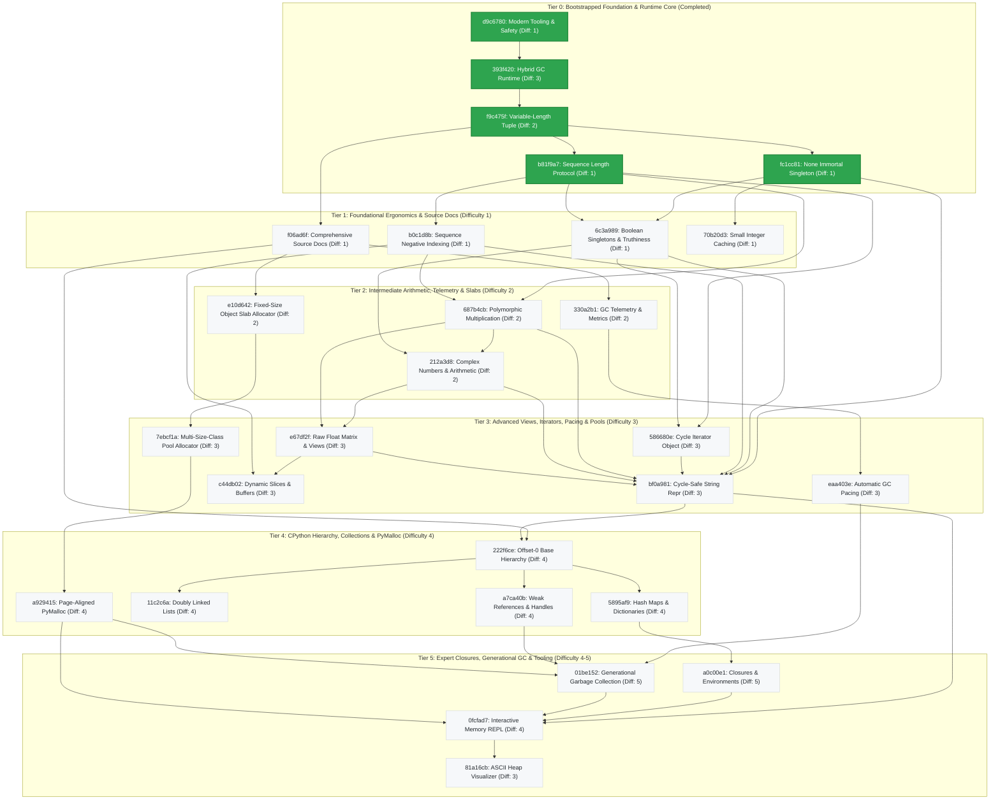

# Architecture & Pedagogical Roadmap DAG (`roadmap/`)

This directory represents the **single authoritative source of truth** for the architecture, engineering milestones, and curriculum of `trash-gather`.

Rather than scattered, parallel tracks, the learning journey is modeled as **one single unified pedagogical Directed Acyclic Graph (DAG)**. Foundational milestones establish memory safety and runtime stability, after which engineering challenges advance strictly by **prerequisite dependencies and difficulty level (easiest tasks first)**.

Every milestone is identified by a **stable 7-character hexadecimal hash ID** (`<hash>_<slug>.md`) and calibrated with a **Difficulty Level from 1 (entry) to 5 (expert)**.

______________________________________________________________________

## 🗺️ Unified Pedagogical Dependency Graph

______________________________________________________________________

## 📚 Milestone Progression Index

### Tier 0: Bootstrapped Foundation & Runtime Core (Completed)

1. **[Learning-Friendly Modern Tooling & Safety Infrastructure](d9c6780_learning_friendly_setup.md)**

   - **ID:** `d9c6780`
   - **Status:** ✅ Completed
   - **Difficulty:** 1 / 5
   - **Prerequisites:** None
   - **Focus:** Professional C tooling from day one (`just`, ASan/UBSan, `bootlib`, `clang-tidy`, `clang-format`, `uv`, `ruff`, `pyrefly`, `pre-commit`, and µnit).

1. **[Hybrid Reference Counting & Cycle Collection Runtime](393f420_hybrid_gc_runtime.md)**

   - **ID:** `393f420`
   - **Status:** ✅ Completed
   - **Difficulty:** 3 / 5
   - **Prerequisites:** [`d9c6780`](d9c6780_learning_friendly_setup.md)
   - **Focus:** Immediate reference counting combined with mark-and-sweep cycle collection, resolving the single-pass deallocation trap, and POSIX de-sneking.

1. **[Heap-Allocated Variable-Length Tuple](f9c475f_heap_allocated_variable_length_tuple.md)**

   - **ID:** `f9c475f`
   - **Status:** ✅ Completed
   - **Difficulty:** 2 / 5
   - **Prerequisites:** [`393f420`](393f420_hybrid_gc_runtime.md)
   - **Focus:** Python-style arbitrary-length immutable tuples via heap-allocated `tuple_t` with a C99 flexible array member, contiguous allocation math, and GC lifecycle integration.

1. **[Polymorphic Sequence Length Protocol](b81f9a7_polymorphic_sequence_length.md)**

   - **ID:** `b81f9a7`
   - **Status:** ✅ Completed
   - **Difficulty:** 1 / 5
   - **Prerequisites:** [`f9c475f`](f9c475f_heap_allocated_variable_length_tuple.md)
   - **Focus:** Implement a polymorphic sequence length protocol (`object_len`) unifying length queries across Strings, Lists, and Tuples with $O(1)$ complexity.

1. **[The `None` Immortal Singleton Object](fc1cc81_none_immortal_singleton.md)**

   - **ID:** `fc1cc81`
   - **Status:** ✅ Completed
   - **Difficulty:** 1 / 5
   - **Prerequisites:** [`f9c475f`](f9c475f_heap_allocated_variable_length_tuple.md)
   - **Focus:** Implement the `None` singleton object, protect it against GC sweep deallocation (immortality), and use it for uninitialized slots and default returns.

______________________________________________________________________

### Tier 1: Foundational Ergonomics & Source Documentation (Difficulty 1)

1. **[Comprehensive Runtime Source Documentation & Doxygen Annotations](f06ad6f_document_entire_source.md)**

   - **ID:** `f06ad6f`
   - **Status:** 📋 Planned
   - **Difficulty:** 1 / 5
   - **Prerequisites:** [`f9c475f`](f9c475f_heap_allocated_variable_length_tuple.md)
   - **Focus:** Add complete Doxygen docstrings, memory ownership contracts, and architectural invariants across all source files in `src/`, expanding automated docstring linting to enforce runtime coverage.

1. **[Python-Style Sequence Negative Indexing](b0c1d8b_python_sequence_negative_indexing.md)**

   - **ID:** `b0c1d8b`
   - **Status:** 📋 Planned
   - **Difficulty:** 1 / 5
   - **Prerequisites:** [`b81f9a7`](b81f9a7_polymorphic_sequence_length.md)
   - **Focus:** Support signed integer offsets (`int64_t`) across list and tuple accessors, enabling Python-style negative indexing (`seq[-1]`) with underflow validation.

1. **[Boolean Immortal Singletons & Truthiness](6c3a989_bool_singletons_and_truthiness.md)**

   - **ID:** `6c3a989`
   - **Status:** 📋 Planned
   - **Difficulty:** 1 / 5
   - **Prerequisites:** [`fc1cc81`](fc1cc81_none_immortal_singleton.md), [`b81f9a7`](b81f9a7_polymorphic_sequence_length.md)
   - **Focus:** Implement immortal boolean singleton objects (`True` and `False`), protect them from GC sweep deallocation, introduce polymorphic truthiness evaluation (`object_is_truthy`, `object_to_bool`), and implement short-circuiting iteration predicates (`object_all`, `object_any`).

1. **[Small Integer Caching](70b20d3_small_integer_caching.md)**

   - **ID:** `70b20d3`
   - **Status:** 📋 Planned
   - **Difficulty:** 1 / 5
   - **Prerequisites:** [`fc1cc81`](fc1cc81_none_immortal_singleton.md)
   - **Focus:** Pre-allocate an immortal static cache of small integer objects (`[-128, 127]`), eliminating heap allocation churn for common numbers and introducing pointer identity semantics.

______________________________________________________________________

### Tier 2: Intermediate Arithmetic, Telemetry & Slabs (Difficulty 2)

1. **[Polymorphic Multiplication & Sequence Repetition](687b4cb_polymorphic_multiplication.md)**

   - **ID:** `687b4cb`
   - **Status:** 📋 Planned
   - **Difficulty:** 2 / 5
   - **Prerequisites:** [`b81f9a7`](b81f9a7_polymorphic_sequence_length.md), [`b0c1d8b`](b0c1d8b_python_sequence_negative_indexing.md)
   - **Focus:** Implement polymorphic binary multiplication (`multiply`) supporting numeric arithmetic (integer and float) and Python-style sequence repetition (string, list, tuple) with commutative operand ordering.

1. **[Complex Numbers & Arithmetic](212a3d8_complex_numbers.md)**

   - **ID:** `212a3d8`
   - **Status:** 📋 Planned
   - **Difficulty:** 2 / 5
   - **Prerequisites:** [`687b4cb`](687b4cb_polymorphic_multiplication.md), [`6c3a989`](6c3a989_bool_singletons_and_truthiness.md)
   - **Focus:** Introduce Python-style complex numbers (`COMPLEX`) with 64-bit IEEE 754 components, integrating into polymorphic arithmetic (`add`, `multiply`), truthiness evaluation, and lifecycle tracking without compiler-specific extensions.

1. **[Garbage Collector Telemetry & Allocation Statistics](330a2b1_gc_telemetry_and_metrics.md)**

   - **ID:** `330a2b1`
   - **Status:** 📋 Planned
   - **Difficulty:** 2 / 5
   - **Prerequisites:** [`f06ad6f`](f06ad6f_document_entire_source.md)
   - **Focus:** Instrument the VM with a telemetry stats structure (`gc_stats_t`), tracking total allocations, freed bytes, sweep counts, and live object counts for runtime observability.

1. **[Fixed-Size Object Slab Allocator](e10d642_object_slab_allocator.md)**

   - **ID:** `e10d642`
   - **Status:** 📋 Planned
   - **Difficulty:** 2 / 5
   - **Prerequisites:** [`f06ad6f`](f06ad6f_document_entire_source.md)
   - **Focus:** Implement a high-throughput fixed-size slab allocator for `object_t` instances, eliminating `malloc` header overhead and heap fragmentation via contiguous 64 KB arenas and intrusive free-list threading.

______________________________________________________________________

### Tier 3: Advanced Views, Iterators, Pacing & Pools (Difficulty 3)

1. **[NumPy-Style Raw Float Matrix & Strided Views](e67df2f_raw_float_matrix.md)**

   - **ID:** `e67df2f`
   - **Status:** 📋 Planned
   - **Difficulty:** 3 / 5
   - **Prerequisites:** [`212a3d8`](212a3d8_complex_numbers.md), [`687b4cb`](687b4cb_polymorphic_multiplication.md)
   - **Focus:** Implement a NumPy-inspired 2D matrix object storing raw float arrays with strided access, zero-copy transpose views, reference-counted base buffer sharing, and polymorphic linear algebra operations.

1. **[Cycle Iterator Object](586680e_cycle_iterator_object.md)**

   - **ID:** `586680e`
   - **Status:** 📋 Planned
   - **Difficulty:** 3 / 5
   - **Prerequisites:** [`b81f9a7`](b81f9a7_polymorphic_sequence_length.md), [`6c3a989`](6c3a989_bool_singletons_and_truthiness.md)
   - **Focus:** Implement an `itertools.cycle`-style circular iterator object that holds a reference to an underlying sequence, cycles through elements indefinitely via modular arithmetic, and integrates with the cycle collector.

1. **[Automatic GC Pacing & Allocation Thresholds](eaa403e_automatic_gc_pacing_and_thresholds.md)**

   - **ID:** `eaa403e`
   - **Status:** 📋 Planned
   - **Difficulty:** 3 / 5
   - **Prerequisites:** [`330a2b1`](330a2b1_gc_telemetry_and_metrics.md)
   - **Focus:** Transition from purely manual collection calls to an automatic, threshold-driven GC pacing engine triggered during memory allocation.

1. **[Multi-Size-Class Pool Allocator](7ebcf1a_size_class_pool_allocator.md)**

   - **ID:** `7ebcf1a`
   - **Status:** 📋 Planned
   - **Difficulty:** 3 / 5
   - **Prerequisites:** [`e10d642`](e10d642_object_slab_allocator.md)
   - **Focus:** Implement a multi-size-class pool allocator (PyMalloc Lite) that categorizes small allocations (16–256 bytes) into discrete size classes and dedicated 4 KB pools, falling back to system malloc for larger requests.

1. **[Dynamic Slices & Byte Buffers (`slice_t`)](c44db02_dynamic_slices_and_byte_buffers.md)**

   - **ID:** `c44db02`
   - **Status:** 📋 Planned
   - **Difficulty:** 3 / 5
   - **Prerequisites:** [`e67df2f`](e67df2f_raw_float_matrix.md), [`b0c1d8b`](b0c1d8b_python_sequence_negative_indexing.md)
   - **Focus:** Implement non-owning container sub-views, resizable raw byte buffers, and investigate interior pointer reference tracking in the garbage collector.

1. **[Cycle-Safe String Representation & Object Printing](bf0a981_cycle_safe_string_repr.md)**

   - **ID:** `bf0a981`
   - **Status:** 📋 Planned
   - **Difficulty:** 3 / 5
   - **Prerequisites:** [`fc1cc81`](fc1cc81_none_immortal_singleton.md), [`6c3a989`](6c3a989_bool_singletons_and_truthiness.md), [`b0c1d8b`](b0c1d8b_python_sequence_negative_indexing.md), [`586680e`](586680e_cycle_iterator_object.md), [`687b4cb`](687b4cb_polymorphic_multiplication.md), [`212a3d8`](212a3d8_complex_numbers.md), [`e67df2f`](e67df2f_raw_float_matrix.md)
   - **Focus:** Serialize arbitrary objects to human-readable strings (`object_to_string()`), detecting and suppressing recursive loops for cyclic structures (`[...]`).

______________________________________________________________________

### Tier 4: CPython Hierarchy, Collections & PyMalloc (Difficulty 4)

1. **[Full CPython-Style Offset-0 Hierarchy](222f6ce_cpython_offset0_hierarchy.md)**

   - **ID:** `222f6ce`
   - **Status:** 📋 Planned
   - **Difficulty:** 4 / 5
   - **Prerequisites:** [`f06ad6f`](f06ad6f_document_entire_source.md), [`bf0a981`](bf0a981_cycle_safe_string_repr.md)
   - **Focus:** Eliminate the tagged union by adopting offset-0 base header embedding (`PyObject` style), achieving single-allocation objects and eliminating union memory bloat.

1. **[Hash Maps & Dictionaries (`dict_t`)](5895af9_hash_maps_and_dictionaries.md)**

   - **ID:** `5895af9`
   - **Status:** 📋 Planned
   - **Difficulty:** 4 / 5
   - **Prerequisites:** [`222f6ce`](222f6ce_cpython_offset0_hierarchy.md)
   - **Focus:** Associative key-value mappings with open addressing, collision probe sequences, tombstone markers, dynamic table resizing, and bidirectional GC traversal.

1. **[Doubly Linked Lists (`linked_list_t`)](11c2c6a_doubly_linked_lists.md)**

   - **ID:** `11c2c6a`
   - **Status:** 📋 Planned
   - **Difficulty:** 4 / 5
   - **Prerequisites:** [`222f6ce`](222f6ce_cpython_offset0_hierarchy.md)
   - **Focus:** Node-based bidirectional sequences with intentional cyclic node references (`prev`/`next`) per node pair to stress-test cyclic GC discovery, traversal, and reclamation.

1. **[Weak References & Non-Owning Pointers (`weakref_t`)](a7ca40b_weak_references_and_non_owning_pointers.md)**

   - **ID:** `a7ca40b`
   - **Status:** 📋 Planned
   - **Difficulty:** 4 / 5
   - **Prerequisites:** [`222f6ce`](222f6ce_cpython_offset0_hierarchy.md)
   - **Focus:** Implement non-owning pointer handles (`weakref_t`) that observe target objects without preventing GC reclamation, automatically clearing to NULL when the referee is collected.

1. **[Page-Aligned PyMalloc with Bitmask Pool Recovery](a929415_page_aligned_pymalloc.md)**

   - **ID:** `a929415`
   - **Status:** 📋 Planned
   - **Difficulty:** 4 / 5
   - **Prerequisites:** [`7ebcf1a`](7ebcf1a_size_class_pool_allocator.md)
   - **Focus:** Implement a full CPython-style PyMalloc allocator featuring 4 KB page alignment, $O(1)$ pool header recovery via address bitmasking (`ptr & ~0xFFF`), and arena address boundary verification.

______________________________________________________________________

### Tier 5: Expert Closures, Generational GC & Tooling (Difficulty 4-5)

1. **[Function Objects & Closures (`closure_t`)](a0c00e1_closures_and_lexical_environments.md)**

   - **ID:** `a0c00e1`
   - **Status:** 📋 Planned
   - **Difficulty:** 5 / 5
   - **Prerequisites:** [`5895af9`](5895af9_hash_maps_and_dictionaries.md)
   - **Focus:** First-class callable objects capturing lexical environments, parent frame retention beyond stack lifetime, and invocation dispatch.

1. **[Generational Garbage Collection](01be152_generational_garbage_collection.md)**

   - **ID:** `01be152`
   - **Status:** 📋 Planned
   - **Difficulty:** 5 / 5
   - **Prerequisites:** [`eaa403e`](eaa403e_automatic_gc_pacing_and_thresholds.md), [`a7ca40b`](a7ca40b_weak_references_and_non_owning_pointers.md), [`a929415`](a929415_page_aligned_pymalloc.md)
   - **Focus:** Multi-generation GC exploiting the weak generational hypothesis, young nursery collections, survivor promotion thresholds, and card-table write barriers.

1. **[Interactive Memory REPL](0fcfad7_interactive_memory_repl.md)**

   - **ID:** `0fcfad7`
   - **Status:** 📋 Planned
   - **Difficulty:** 4 / 5
   - **Prerequisites:** [`bf0a981`](bf0a981_cycle_safe_string_repr.md), [`a0c00e1`](a0c00e1_closures_and_lexical_environments.md), [`01be152`](01be152_generational_garbage_collection.md), [`a929415`](a929415_page_aligned_pymalloc.md)
   - **Focus:** Live terminal CLI (`just run`) for interactive object allocation, frame stack operations, triggering GC passes, and inspecting runtime telemetry.

1. **[ASCII Heap Visualizer](81a16cb_ascii_heap_visualizer.md)**

   - **ID:** `81a16cb`
   - **Status:** 📋 Planned
   - **Difficulty:** 3 / 5
   - **Prerequisites:** [`0fcfad7`](0fcfad7_interactive_memory_repl.md)
   - **Focus:** Real-time ASCII pointer graph trees, root frame traversal, object reachability visualization, and cycle suppression.
