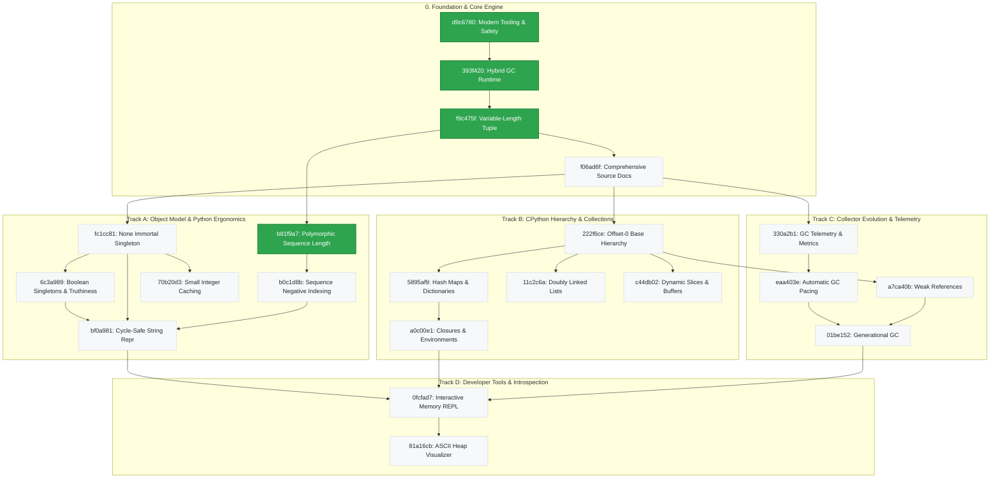

# Architecture & Pedagogical Roadmap DAG (`roadmap/`)

This directory represents the **single authoritative source of truth** for the architecture, engineering milestones, and curriculum of `trash-gather`.

Rather than a rigid linear pipeline, the learning journey is modeled as a **pedagogical Directed Acyclic Graph (DAG)**. Foundational milestones establish memory safety and runtime stability, after which engineering challenges branch into specialized tracks (object semantics, advanced container memory layouts, and garbage collector evolution) before converging into interactive developer tooling.

Every milestone is identified by a **stable 7-character hexadecimal hash ID** (`<hash>_<slug>.md`). Writeups are decoupled from sequential numbers, allowing prerequisites to form a natural dependency graph.

______________________________________________________________________

## 🗺️ Visual Pedagogical Dependency Graph

______________________________________________________________________

## 📚 Milestone Tracks & Dependency Index

### Phase 0: Foundation & Core Engine

1. **[Learning-Friendly Modern Tooling & Safety Infrastructure](d9c6780_learning_friendly_setup.md)**

   - **ID:** `d9c6780`
   - **Status:** ✅ Completed
   - **Prerequisites:** None
   - **Focus:** Professional C tooling from day one (`just`, ASan/UBSan, `bootlib`, `clang-tidy`, `clang-format`, `uv`, `ruff`, `pyrefly`, `pre-commit`, and µnit).

1. **[Hybrid Reference Counting & Cycle Collection Runtime](393f420_hybrid_gc_runtime.md)**

   - **ID:** `393f420`
   - **Status:** ✅ Completed
   - **Prerequisites:** [`d9c6780`](d9c6780_learning_friendly_setup.md)
   - **Focus:** Immediate reference counting combined with mark-and-sweep cycle collection, resolving the single-pass deallocation trap, and POSIX de-sneking.

1. **[Heap-Allocated Variable-Length Tuple](f9c475f_heap_allocated_variable_length_tuple.md)**

   - **ID:** `f9c475f`
   - **Status:** ✅ Completed
   - **Prerequisites:** [`393f420`](393f420_hybrid_gc_runtime.md)
   - **Focus:** Python-style arbitrary-length immutable tuples via heap-allocated `tuple_t` with a C99 flexible array member, contiguous allocation math, and GC lifecycle integration.

1. **[Comprehensive Runtime Source Documentation & Doxygen Annotations](f06ad6f_document_entire_source.md)**

   - **ID:** `f06ad6f`
   - **Status:** 📋 Planned
   - **Prerequisites:** [`f9c475f`](f9c475f_heap_allocated_variable_length_tuple.md)
   - **Focus:** Add complete Doxygen docstrings, memory ownership contracts, and architectural invariants across all source files in `src/`, expanding automated docstring linting to enforce runtime coverage.

______________________________________________________________________

### Track A: Object Model & Python Ergonomics

1. **[Polymorphic Sequence Length Protocol](b81f9a7_polymorphic_sequence_length.md)**

   - **ID:** `b81f9a7`
   - **Status:** ✅ Completed
   - **Prerequisites:** [`f9c475f`](f9c475f_heap_allocated_variable_length_tuple.md)
   - **Focus:** Implement a polymorphic sequence length protocol (`object_len`) unifying length queries across Strings, Lists, and Tuples with $O(1)$ complexity.

1. **[Python-Style Sequence Negative Indexing](b0c1d8b_python_sequence_negative_indexing.md)**

   - **ID:** `b0c1d8b`
   - **Status:** 📋 Planned
   - **Prerequisites:** [`b81f9a7`](b81f9a7_polymorphic_sequence_length.md)
   - **Focus:** Support signed integer offsets (`int64_t`) across list and tuple accessors, enabling Python-style negative indexing (`seq[-1]`) with underflow validation.

1. **[The `None` Immortal Singleton Object](fc1cc81_none_immortal_singleton.md)**

   - **ID:** `fc1cc81`
   - **Status:** 📋 Planned
   - **Prerequisites:** [`f06ad6f`](f06ad6f_document_entire_source.md)
   - **Focus:** Implement the `None` singleton object, protect it against GC sweep deallocation (immortality), and use it for uninitialized slots and default returns.

1. **[Boolean Immortal Singletons & Truthiness](6c3a989_bool_singletons_and_truthiness.md)**

   - **ID:** `6c3a989`
   - **Status:** 📋 Planned
   - **Prerequisites:** [`fc1cc81`](fc1cc81_none_immortal_singleton.md)
   - **Focus:** Implement immortal boolean singleton objects (`True` and `False`), protect them from GC sweep deallocation, and introduce runtime truthiness evaluation (`object_is_truthy`).

1. **[Small Integer Caching](70b20d3_small_integer_caching.md)**

   - **ID:** `70b20d3`
   - **Status:** 📋 Planned
   - **Prerequisites:** [`fc1cc81`](fc1cc81_none_immortal_singleton.md)
   - **Focus:** Pre-allocate an immortal static cache of small integer objects (`[-128, 127]`), eliminating heap allocation churn for common numbers and introducing pointer identity semantics.

1. **[Cycle-Safe String Representation & Object Printing](bf0a981_cycle_safe_string_repr.md)**

   - **ID:** `bf0a981`
   - **Status:** 📋 Planned
   - **Prerequisites:** [`fc1cc81`](fc1cc81_none_immortal_singleton.md), [`6c3a989`](6c3a989_bool_singletons_and_truthiness.md), [`b0c1d8b`](b0c1d8b_python_sequence_negative_indexing.md)
   - **Focus:** Serialize arbitrary objects to human-readable strings (`object_to_string()`), detecting and suppressing recursive loops for cyclic structures (`[...]`).

______________________________________________________________________

### Track B: CPython Hierarchy & Collections

1. **[Full CPython-Style Offset-0 Hierarchy](222f6ce_cpython_offset0_hierarchy.md)**

   - **ID:** `222f6ce`
   - **Status:** 📋 Planned
   - **Prerequisites:** [`f06ad6f`](f06ad6f_document_entire_source.md)
   - **Focus:** Eliminate the tagged union by adopting offset-0 base header embedding (`PyObject` style), achieving single-allocation objects and eliminating union memory bloat.

1. **[Hash Maps & Dictionaries (`dict_t`)](5895af9_hash_maps_and_dictionaries.md)**

   - **ID:** `5895af9`
   - **Status:** 📋 Planned
   - **Prerequisites:** [`222f6ce`](222f6ce_cpython_offset0_hierarchy.md)
   - **Focus:** Associative key-value mappings with open addressing, collision probe sequences, tombstone markers, dynamic table resizing, and bidirectional GC traversal.

1. **[Doubly Linked Lists (`linked_list_t`)](11c2c6a_doubly_linked_lists.md)**

   - **ID:** `11c2c6a`
   - **Status:** 📋 Planned
   - **Prerequisites:** [`222f6ce`](222f6ce_cpython_offset0_hierarchy.md)
   - **Focus:** Node-based bidirectional sequences with intentional cyclic node references (`prev`/`next`) per node pair to stress-test cyclic GC discovery, traversal, and reclamation.

1. **[Dynamic Slices & Byte Buffers (`slice_t`)](c44db02_dynamic_slices_and_byte_buffers.md)**

   - **ID:** `c44db02`
   - **Status:** 📋 Planned
   - **Prerequisites:** [`222f6ce`](222f6ce_cpython_offset0_hierarchy.md)
   - **Focus:** Non-owning sub-views borrowing from underlying containers, resizable raw byte storage, and object retention mechanics.

1. **[Function Objects & Closures (`closure_t`)](a0c00e1_closures_and_lexical_environments.md)**

   - **ID:** `a0c00e1`
   - **Status:** 📋 Planned
   - **Prerequisites:** [`5895af9`](5895af9_hash_maps_and_dictionaries.md)
   - **Focus:** First-class callable objects capturing lexical environments, parent frame retention beyond stack lifetime, and invocation dispatch.

______________________________________________________________________

### Track C: Collector Evolution & Telemetry

1. **[Garbage Collector Telemetry & Allocation Statistics](330a2b1_gc_telemetry_and_metrics.md)**

   - **ID:** `330a2b1`
   - **Status:** 📋 Planned
   - **Prerequisites:** [`f06ad6f`](f06ad6f_document_entire_source.md)
   - **Focus:** Instrument the VM with a telemetry stats structure (`gc_stats_t`), tracking total allocations, freed bytes, sweep counts, and live object counts for runtime observability.

1. **[Automatic GC Pacing & Allocation Thresholds](eaa403e_automatic_gc_pacing_and_thresholds.md)**

   - **ID:** `eaa403e`
   - **Status:** 📋 Planned
   - **Prerequisites:** [`330a2b1`](330a2b1_gc_telemetry_and_metrics.md)
   - **Focus:** Transition from purely manual collection calls to an automatic, threshold-driven GC pacing engine triggered during memory allocation.

1. **[Weak References & Non-Owning Pointers (`weakref_t`)](a7ca40b_weak_references_and_non_owning_pointers.md)**

   - **ID:** `a7ca40b`
   - **Status:** 📋 Planned
   - **Prerequisites:** [`222f6ce`](222f6ce_cpython_offset0_hierarchy.md)
   - **Focus:** Implement non-owning pointer handles (`weakref_t`) that observe target objects without preventing GC reclamation, automatically clearing to NULL when the referee is collected.

1. **[Generational Garbage Collection](01be152_generational_garbage_collection.md)**

   - **ID:** `01be152`
   - **Status:** 📋 Planned
   - **Prerequisites:** [`eaa403e`](eaa403e_automatic_gc_pacing_and_thresholds.md), [`a7ca40b`](a7ca40b_weak_references_and_non_owning_pointers.md)
   - **Focus:** Multi-generation GC exploiting the weak generational hypothesis, young nursery collections, survivor promotion thresholds, and card-table write barriers.

______________________________________________________________________

### Track D: Developer Tools & Introspection

1. **[Interactive Memory REPL](0fcfad7_interactive_memory_repl.md)**

   - **ID:** `0fcfad7`
   - **Status:** 📋 Planned
   - **Prerequisites:** [`bf0a981`](bf0a981_cycle_safe_string_repr.md), [`a0c00e1`](a0c00e1_closures_and_lexical_environments.md), [`01be152`](01be152_generational_garbage_collection.md)
   - **Focus:** Live terminal CLI (`just run`) for interactive object allocation, frame stack operations, triggering GC passes, and inspecting runtime telemetry.

1. **[ASCII Heap Visualizer](81a16cb_ascii_heap_visualizer.md)**

   - **ID:** `81a16cb`
   - **Status:** 📋 Planned
   - **Prerequisites:** [`0fcfad7`](0fcfad7_interactive_memory_repl.md)
   - **Focus:** Real-time ASCII pointer graph trees, root frame traversal, object reachability visualization, and cycle suppression.
